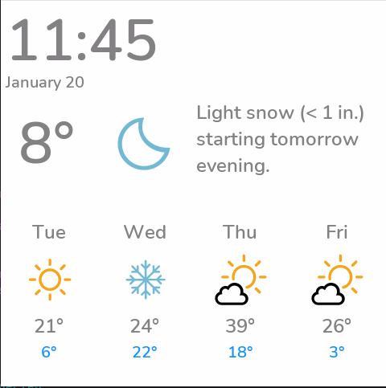

# Weather Home Assistant Library

This library provides weather display components for ESPHome LVGL panels with Home Assistant integration.



## Components

### weather_forecast_action.yaml

Displays a 4-day weather forecast using direct Home Assistant action calls. No template sensor configuration required in Home Assistant!

**Features:**
- Fetches forecast data directly from HA using `weather.get_forecasts` action
- Auto-refreshes every hour and on HA connection
- Displays daily high/low temperatures with condition icons
- Weather icons included automatically (80px default)

**Required vars:**
| Variable | Description | Default |
|----------|-------------|---------|
| `size` | Icon size in pixels | - |
| `weather_entity` | HA weather entity ID | `weather.home` |

**Usage:**
```yaml
packages:
  weather_forecast: !include
    file: esphome-modular-lvgl-buttons/weather_homeassistant/weather_forecast_action.yaml
    vars:
      size: 80
      weather_entity: weather.home
```

### weather_today.yaml

Displays current weather conditions with temperature and optional summary text.

**Features:**
- Shows current temperature from weather entity
- Displays weather condition icon
- Optional summary text from separate sensor
- Weather icons included automatically (parameterized size)

**Required vars:**
| Variable | Description | Default |
|----------|-------------|---------|
| `size` | Icon size in pixels | - |
| `weather_entity` | HA weather entity ID | `weather.home` |
| `weather_summary` | HA sensor for text summary | - |

**Usage:**
```yaml
packages:
  weather_today: !include
    file: esphome-modular-lvgl-buttons/weather_homeassistant/weather_today.yaml
    vars:
      size: 100
      weather_entity: weather.home
      weather_summary: sensor.home_hourly_summary
```

### weather_icons_update.yaml

Helper file for updating weather condition icons. Called internally by the other weather components.

## LVGL Widget IDs

These widget IDs are created and can be referenced in your layouts:

### From weather_forecast_action.yaml
- `forecast_day_0` through `forecast_day_3` - Day labels
- `forecast_temp_hi_0` through `forecast_temp_hi_3` - High temperature labels
- `forecast_temp_lo_0` through `forecast_temp_lo_3` - Low temperature labels  
- `forecast_condition_icon_0` through `forecast_condition_icon_3` - Condition icons

### From weather_today.yaml
- `weather_temperature_today` - Current temperature label
- `weather_condition_icon` - Current condition icon
- `weather_summary_today` - Summary text label

## Directory Structure

```
weather_homeassistant/
├── README.md                      # This file
├── weather_forecast_action.yaml   # 4-day forecast component
├── weather_today.yaml             # Current weather component
├── weather_icons_update.yaml      # Icon update helper
├── assets/
│   └── images/                    # SVG weather icons
└── example_images/
    └── weather_ha.png             # Screenshot example
```

## Complete Example

See the main project's [SDL-weather-forcast.yaml](../example_code_advanced/SDL-weather-forcast.yaml) for a complete working example that combines both weather components with a time display.
